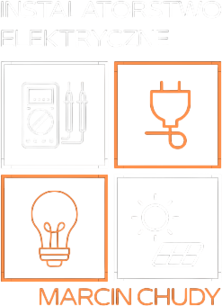

# Instalatorstwo Elektryczne Marcin Chudy

<p align="center">
  
</p>

## 👀 About

Lightweight website designed and developed for the client from electrical industry, which is intended to serve as a business card. Created using HTML, SCSS, Bootstrap and vanilla JavaScript. Chose framework-free implementation to reduce overhead and better align with long-term maintainability and budget constraints.

## 🔧 Tech Stack

**Frontend:** HTML, SCSS, JavaScript, Bootstrap
**Integrations:** Google Analytics

## 💡 Features

- Eye-catching, well-tailored and well-thought user interface.
- Responsive Web Design to improve accessibility of page at all types of devices.
- Photo galleries to show recent projects clearly.
- Integration with Google Analytics for tracking website traffic in easy way.
- Anti-spam contact information (phone and email) protection.

## ▶️ Run

Clone the repository

```bash
git clone git@github.com:P4ZD4N/instalatorstwo-elektryczne.git
```

Navigate to the project directory

```bash
cd /path/to/instalatorstwo-elektryczne
```

Double click on index.html

